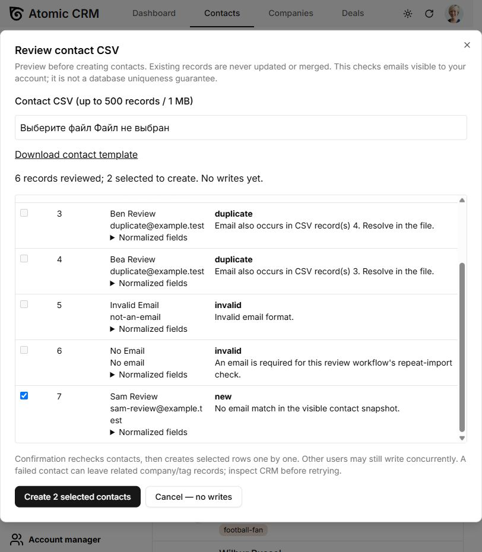

# Contact CSV review — extension of Atomic CRM

Independent engineering example by Ivan Matiushkin, developed with Codex. The CRM itself is **[Atomic CRM by Marmelab](https://github.com/marmelab/atomic-crm)**, licensed under MIT. This is an attributed extension, not a claim to have built the CRM or delivered it for a client.

Upstream baseline: `b23289b46734d796e74edd3ef224cbf23792ff82`.



## Problem and change

The upstream CSV import begins processing after file selection and start. It already has batches, progress, cancellation and partial-failure counting. Those are upstream capabilities.

This extension adds a separate **Review contacts** action alongside the unchanged original importer:

1. Parse a contact CSV without writes, preserve phone prefixes and normalize email casing/whitespace.
2. Read a bounded snapshot of contacts visible to the current user.
3. Show every CSV record as new, invalid, duplicate, existing or conflicting. All occurrences of an in-file duplicate are blocked. Existing email matches are never automatically merged or updated.
4. Select valid new rows, inspect normalized fields, or cancel without creating contacts, companies or tags.
5. Re-read contacts before confirmation, then process selected records one at a time using the existing contact adapter.
6. Show and download individual created/skipped/failed/unconfirmed results. Stop after the current request; never automatically retry an unknown outcome.

Repeat imports of the included sample are proposed as skips once the successfully created contacts are visible. Email equality is a matching rule, not proof that two people are identical.

## Try it without a cloud account

```sh
npm ci
npm run dev:demo
```

Open the local URL, go to Contacts and select **Review contacts**. Upload `test-data/contact-review.csv`. Two new rows should be selectable; two duplicates, one malformed email and one missing email are blocked. Cancel first to inspect the zero-write flow. Reopen, import the two eligible contacts, then preview the same file again.

The demo uses Atomic CRM's in-browser FakeRest provider with synthetic records. Telemetry is disabled in `demo/App.tsx`. There is no claim that this extension has been deployed or validated against a live Supabase account.

## Code review map

- `contactReview.ts`: parser, validation, match planner, read-only snapshot and sequential result accounting.
- `ContactReviewDialog.tsx`: file selection, review table, create/skip choices, explicit confirmation and result export.
- `DataImportProvider.tsx` / `DataImportButton.tsx`: integration with the existing global import ownership and controls.
- `contactReview.test.ts`: malformed input, identity collisions, stale preview, repeat import, provider failures and cancellation.
- `ContactReviewDialog.test.tsx`: browser tests with the real FakeRest adapter; no writes before confirmation, preservation of phone prefixes and repeat preview.

The registry generator also uses portable slash-separated glob patterns so it does not erase the component listing on Windows. Upstream automation definitions are preserved as inert text under `docs/upstream-workflows/`; only the new validation workflow is active. No deployment or cloud-agent workflow is enabled by this extension.

Paths are under `src/components/atomic-crm/dataImport/`.

## Validate

```sh
npx playwright install chromium --only-shell
npm run typecheck
npm run test:unit:app -- --run --project app src/components/atomic-crm/dataImport
npm run build:demo
```

See [verification](docs/import-review-verification.md) for actual results. The additional `import-review.yml` CI workflow validates this scope without deploying.

## Deliberate limits

- Contact review supports at most 500 records / 1 MB and snapshots of at most 10,000 visible contacts. These are UI/runtime bounds, not scale claims. Unknown columns are rejected. Review requires email; the original importer remains available for other upstream use cases.
- No cross-user locking, unique database constraint, transaction or concurrent-import guarantee is introduced. Fresh read-before-write reduces stale decisions but is not atomic.
- RLS may hide records. A complete visible list does not prove global uniqueness. No RLS/security certification is claimed.
- The existing adapter can create a company or tag before a contact fails. No rollback is claimed. A failed or unconfirmed record requires inspection before a fresh preview.
- This is an English-language review UI. Upstream localization and company/deal import paths remain as they were.
- No name-only auto-match, update, delete, fuzzy merge or real client dataset is included.

## Relevant first paid task

A bounded import preview, validation rule or exception screen in an existing React/TypeScript app. After inspecting the actual system, agree one input format, matching rules, output and acceptance cases. Backend concurrency guarantees or a live-provider integration are separate scope.

Safe proof line: “I extended the open-source Atomic CRM with a contact CSV preview that flags duplicate and conflicting records before creation, with browser-tested review and per-row results.”

This does not establish paid client history, commercial CRM implementation experience, ownership of upstream work, or production reliability.

[Portfolio](https://work.matiushkin.com/en) · ivan@matiushkin.com
